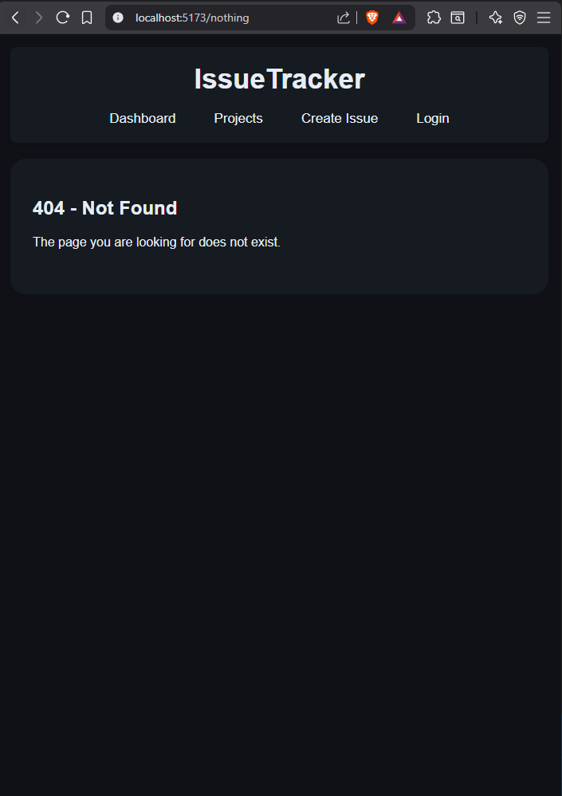
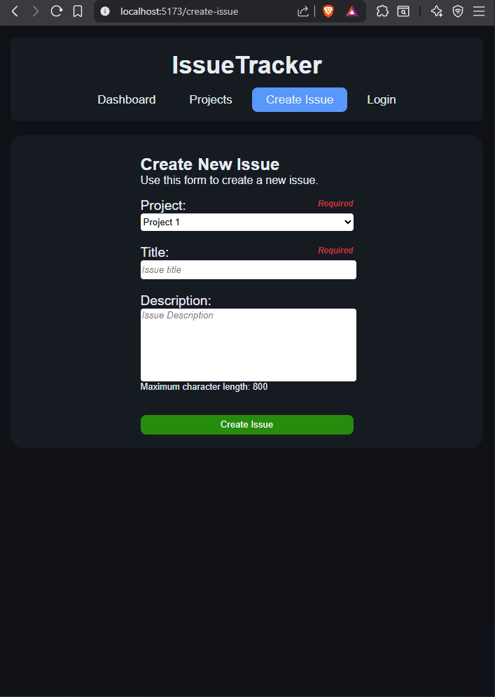
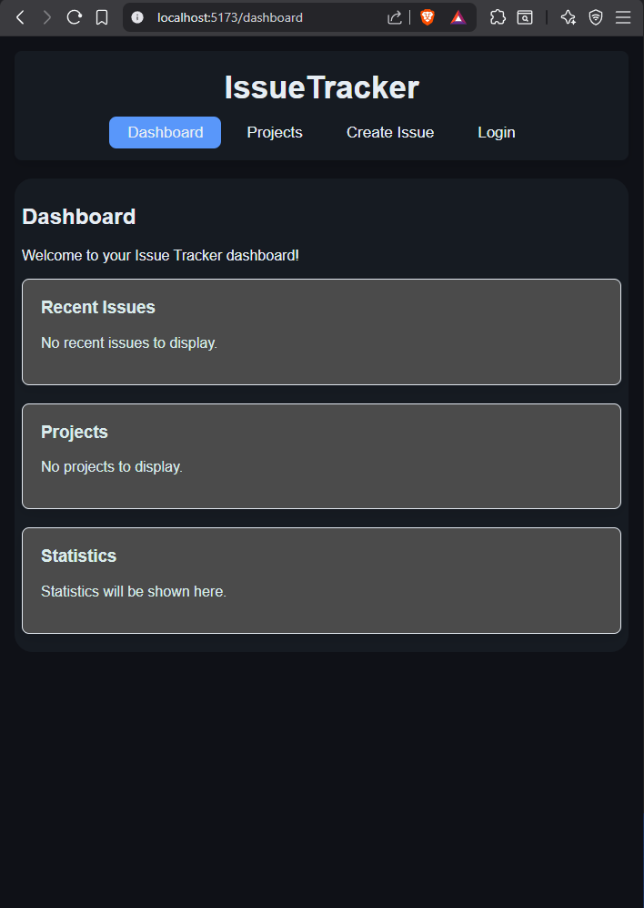
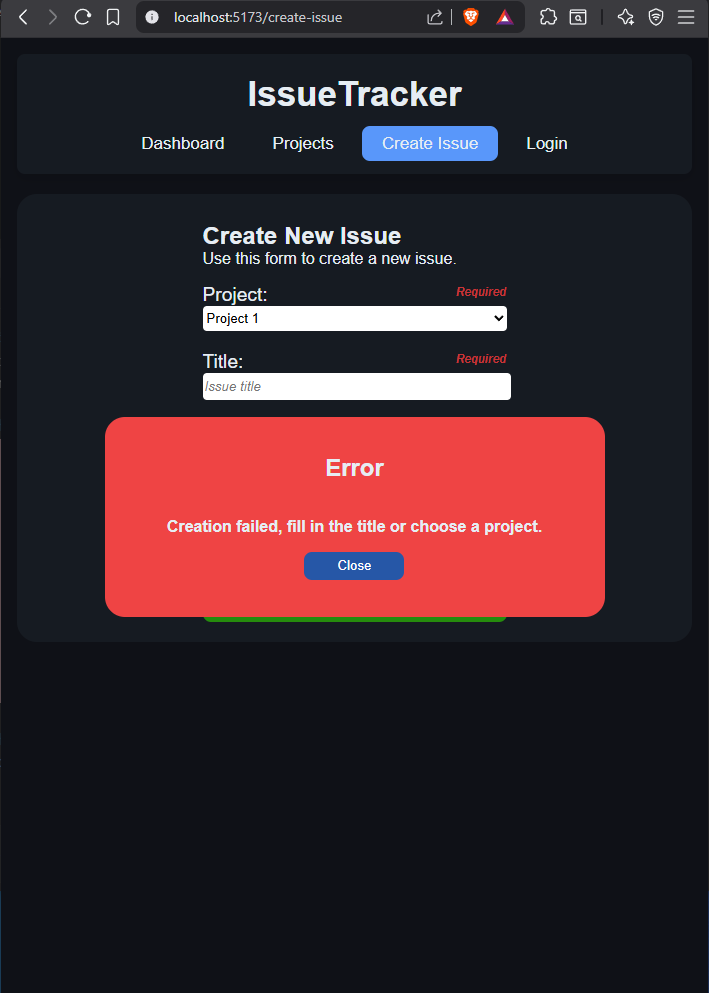
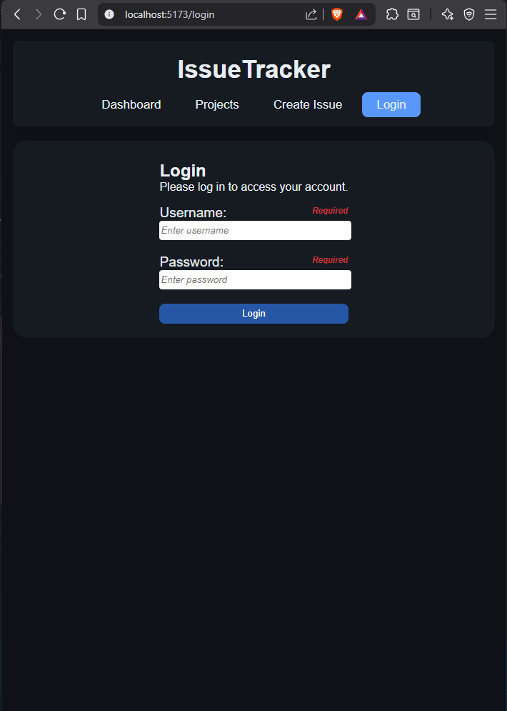
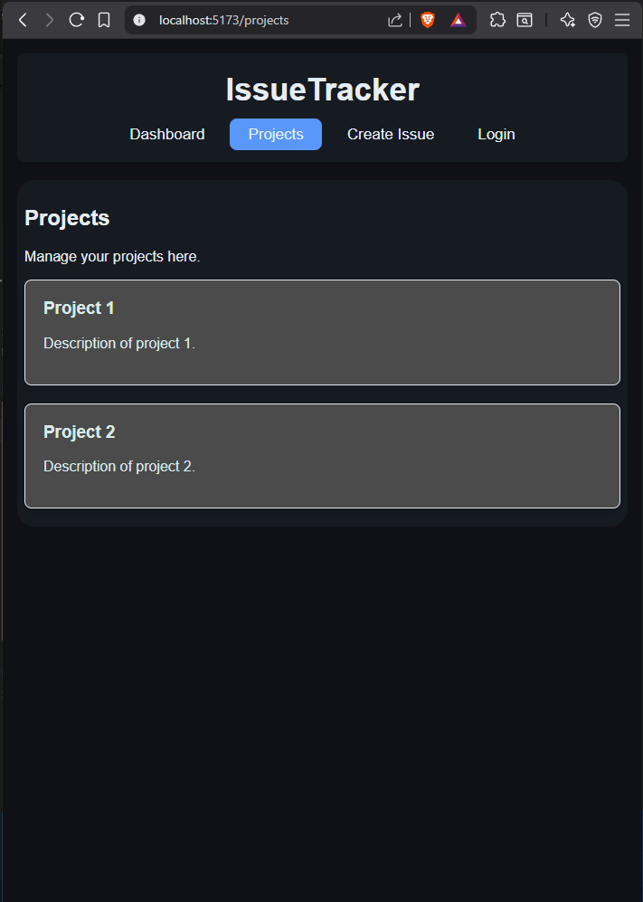

### Description:
- This project was developed as part of a university course and is structured around three key milestones: _frontend_, _backend_, and _database_.

### Screenshots:

  
  
  
  
  
  

